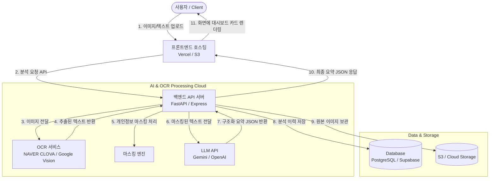

# 쉽게말해 AI - 백엔드 서버 아키텍처 및 구성 가이드

이 문서는 '쉽게말해 AI' 서비스를 실제 동작하는 상용 서비스로 구축하기 위한 백엔드 시스템 설계 및 아키텍처 구성 가이드입니다. 프론트엔드와 AI 백엔드 개발자 간의 협업 및 시스템 구현의 이정표로 활용하십시오.

---

## 1. 전체 시스템 아키텍처 (System Architecture)

전체 시스템은 다음과 같은 흐름으로 사용자 요청을 처리하고 AI 분석 결과를 반환합니다.



---

## 2. 주요 서버 구성 요소 및 역할

### 1) 프론트엔드 호스팅 (Client Area)
- **역할**: 사용자가 접속하는 화면(웹페이지)을 서비스하고 기기별(모바일/데스크탑) 최적의 UI를 제공합니다.
- **추천 기술**: React.js / Next.js 또는 static HTML 파일을 **Vercel** 또는 **AWS S3 + CloudFront**를 통해 정적 호스팅합니다.

### 2) 백엔드 API 서버 (Core Control Tower)
- **역할**: 프론트엔드로부터 이미지를 전달받아 OCR -> 마스킹 -> LLM 요약으로 이어지는 전체 파이프라인을 조율(Orchestration)하고, 외부 API Key의 보안 노출을 차단합니다.
- **추천 기술**: **Python FastAPI** (AI 라이브러리 및 비동기 처리 친화적) 또는 **Node.js Express** (자바스크립트 기반 프론트엔드와의 일관성).

### 3) 문자 인식 엔진 (OCR Engine)
- **역할**: 업로드된 이미지 파일(JPG, PNG, PDF)에서 한국어 텍스트를 정확하게 판독하여 디지털 텍스트로 변환합니다.
- **추천 기술**:
  - **NAVER CLOVA OCR**: 한국어 공문서/고지서 특화 성능이 매우 뛰어납니다. (추천)
  - **Google Cloud Vision API**: 범용적이고 비교적 단가가 저렴합니다.

### 4) 쉬운 말 요약 및 구조화 엔진 (LLM API)
- **역할**: 추출된 원문 텍스트를 전달받아 "한 줄 결론", "To-Do 체크리스트", "중요 날짜", "준비물" 등 사전에 협의한 JSON 포맷에 맞추어 쉬운 한글 문장으로 정리합니다.
- **추천 기술**: **Google Gemini 1.5 Pro API** (한국어 이해도와 경제성 우수) 또는 **OpenAI GPT-4o API**.

### 5) 데이터베이스 및 저장소 (Database & Storage)
- **역할**: 이미지 원본 파일을 안전한 스토리지에 보관하고, 분석이 완료된 요약 이력을 DB에 저장하여 사용자가 과거 분석 결과를 다시 볼 수 있도록 지원합니다.
- **추천 기술**: 이미지 저장은 **AWS S3**, 데이터 저장은 **PostgreSQL** 또는 **Supabase** (BaaS) 활용.

---

## 3. 핵심 데이터 흐름 시나리오 (Data Flow Sequence)

사용자가 고지서 사진을 올렸을 때 백엔드 서버 내부에서 일어나는 세부 시나리오는 다음과 같습니다.

```
[클라이언트]               [백엔드 API]              [OCR 서비스]             [LLM (AI) API]
    │                          │                          │                          │
    │ ─── 1. 이미지 전송 ───>  │                          │                          │
    │                          │ ─── 2. 이미지 판독 요청 ─> │                          │
    │                          │ <── 3. 원문 텍스트 반환 ── │                          │
    │                          │                          │                          │
    │                          │ ─── 4. 개인정보 필터링(가림 처리) ────────────────> │
    │                          │      * 이름/주민번호/주소를 감춘 뒤 요약 프롬프트와 함께 전달
    │                          │                                                     │
    │                          │ <── 5. 구조화된 JSON 데이터 반환 (요약 완료) ──────── │
    │                          │      * (규격 예시: { conclusion, tasks: [], dates: [] })
    │                          │                          │                          │
    │ <── 6. JSON 결과 응답 ── │                          │                          │
    ▼                          ▼                          ▼                          ▼
```

---

## 4. 백엔드 개발자 협업을 위한 추천 기술 스택 세트

AI 파트(백엔드) 개발자와 협업하여 서비스를 쉽고 빠르게 런칭하기 위한 추천 패키지 구성안입니다.

### 💡 구성안 A: 백엔드 노코드/최소코드 구성 (초기 런칭용 - 강력 추천)
> 개발 리소스가 부족하고 백엔드 서버 관리를 최소화하고 싶을 때 가장 이상적입니다.

- **프론트엔드 호스팅**: Vercel
- **백엔드 & 데이터베이스**: **Supabase** (PostgreSQL 데이터베이스와 사용자 인증, 이미지 스토리지를 통합 지원하는 서비스)
- **AI 및 API 핸들링**: Vercel Serverless Functions (프론트엔드 프로젝트 내의 `/api` 폴더에서 OpenAI/Gemini API 및 CLOVA OCR API를 비밀스럽게 호출)
- **특징**: 독립적인 서버 컴퓨터를 임대 및 세팅(CentOS, Ubuntu 등 OS 설정)할 필요가 없어 서버 관리 부담이 0에 가깝습니다.

### 🛠️ 구성안 B: 독립 백엔드 서버 구성 (정석적인 아키텍처)
> 서비스 규모 확장과 정밀한 백엔드 비즈니스 로직 제어가 필요할 때 적합합니다.

- **프론트엔드**: HTML/CSS/JS 정적 배포 (AWS S3)
- **백엔드 서버**: **Python FastAPI** 또는 **Node.js Express** (Docker 컨테이너로 패키징하여 AWS ECS 또는 가벼운 카페24 가상서버에 배포)
- **데이터베이스**: AWS RDS (PostgreSQL)
- **특징**: 백엔드 개발자가 선호하는 자유로운 환경이며, 다양한 AI 모델 연동 및 복잡한 정산, 로그 수집 등이 용이합니다.

---

## 5. 설계 시 핵심 고려사항 (Security & UX)

1. **개인정보 보호 (Masking)**:
   - 고지서나 행정 문서에는 주민등록번호, 계좌번호, 상세 주소 등 극히 민감한 개인정보가 포함됩니다.
   - 백엔드 서버는 OCR 텍스트를 LLM(AI) API에 전달하기 전, **정규식(Regex)을 이용해 주민번호(`\d{6}-\d{7}`)나 전화번호 등을 반드시 가림(`***-****-****`) 처리**한 뒤 전송해야 개인정보 유출 방지 및 규정을 준수할 수 있습니다.
2. **동기식 vs 비동기식 처리**:
   - `이미지 분석(OCR) -> LLM 요약` 프로세스는 약 5~8초 정도의 시간이 걸립니다.
   - 요청을 처리하는 동안 클라이언트에 중간 과정을 친절히 설명해주도록 비동기 웹소켓(WebSocket) 또는 로딩 상태 피드백 처리를 기획해야 이탈률을 낮출 수 있습니다. (현재 데모 페이지에 구현된 다단계 로딩 애니메이션 흐름과 결합)
